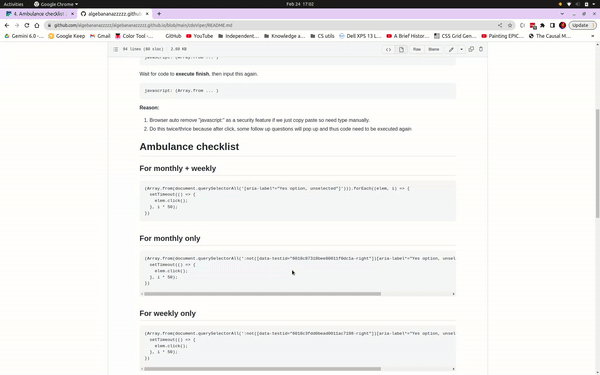

# Autoclicker for FormSG

ID10T instructions: **type** javascript: into browser, **then** copy paste code. **Do this twice. Thrice for resus**

**You must manually type the string *javascript:* in browser first before copy paste code**


E.g. To do daily ambulance, so I'll input this into browser
```
javascript: (Array.from ... )
```
Wait for code to **execute finish**, then input this again.
```
javascript: (Array.from ... )
```

**Reason:**
1. Browser auto remove "javascript:" as a security feature if we just copy paste so need type manually.
2. Do this twice/thrice because after click, some follow up questions will pop up and thus code need to be executed again



# Ambulance checklist
## For monthly + weekly
```
(Array.from(document.querySelectorAll('[aria-label="Yes option, unselected"]'))).forEach((elem, i) => {
  setTimeout(() => {
    elem.click();
  }, i * 50);
})
```

## For monthly only
```
(Array.from(document.querySelectorAll(':not([data-testid="6018c87318bee80011f0dc1a-right"])[aria-label="Yes option, unselected"] '))).forEach((elem, i) => {
  setTimeout(() => {
    elem.click();
  }, i * 50);
})
```

## For weekly only
```
(Array.from(document.querySelectorAll(':not([data-testid="6018c3fdd0bead0011ac7198-right"])[aria-label="Yes option, unselected"] '))).forEach((elem, i) => {
  setTimeout(() => {
    elem.click();
  }, i * 50);
})
```

## For daily only
```
(Array.from(document.querySelectorAll(':not([data-testid="6018c3fdd0bead0011ac7198-right"]):not([data-testid="6018c87318bee80011f0dc1a-right"])[aria-label="Yes option, unselected"] '))).forEach((elem, i) => {
  setTimeout(() => {
    elem.click();
  }, i * 50);
})
```

# Resus checklist
## For monthly + weekly
```
(Array.from(document.querySelectorAll('[aria-label="Yes option, unselected"]'))).forEach((elem, i) => {
  setTimeout(() => {
    elem.click();
  }, i * 50);
})
```

## For monthly only
```
(Array.from(document.querySelectorAll(':not([data-testid="5ff571dfb3f0b4001141cabb-right"]):not([data-testid="5ffd4c35209d9a0012c53075-right"])[aria-label="Yes option, unselected"] '))).forEach((elem, i) => {
  setTimeout(() => {
    elem.click();
  }, i * 50);
})
```

## For weekly only
```
(Array.from(document.querySelectorAll(':not([data-testid="5ffd558ffbd2de0011902b0c-right"])[aria-label="Yes option, unselected"] '))).forEach((elem, i) => {
  setTimeout(() => {
    elem.click();
  }, i * 50);
})
```

## For daily only
```
(Array.from(document.querySelectorAll(':not([data-testid="5ff571dfb3f0b4001141cabb-right"]):not([data-testid="5ffd558ffbd2de0011902b0c-right"]):not([data-testid="5ffd4c35209d9a0012c53075-right"])[aria-label="Yes option, unselected"] '))).forEach((elem, i) => {
  setTimeout(() => {
    elem.click();
  }, i * 50);
})
```
